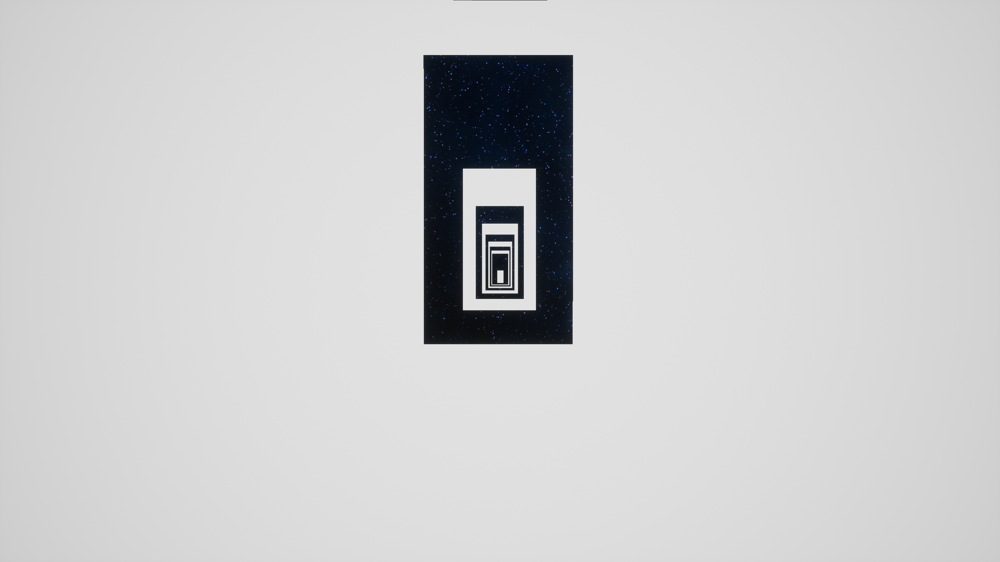

# AlteredGravity

A game with the aim of creating optical illusions and manipulating the space perception of the player.

## Launch on Windows

Only available on Windows 64 bit.

Playable version downloadable from [here](https://mega.nz/file/mpRkXBBS#f8bPJwpPH9DG1QesDNHW9bwchkE6qVh5SYo2ddF47Qs). Unzip the file and launch Windows/AlteredGravity.exe. If some prerequisites are not yet present on your PC, the installation prompt will automatically appear.

The game stores its save files at C:/\<username\>/AppData/Local/AlteredGravity/Saved. If you do not wish to play anymore, you can safely delete these files.

## How to play

The aim is to find the way forward despite the optical illusions or deceptions. You know you finished the game when you see the credits appearing.

Use WASD keys to move, and the mouse to look around. You cannot jump, crouch or do any other special movements.

By pressing ESC, you can access the Main Menu, from which you can save, load or start a new game, or adjust graphic settings. 

## Tips

Please note that this game was originally created for my thesis, so it is not professionally made. Thus, it may contain bugs or malfunctions. If you think you encountered one, I advise you to load a previous state of the game. I recommend saving often and to multiple slots.

Feel free to share your thoughts via petrok.flora@gmail.com. Any feedback or observations are appreciated!

## Thank you for playing!

Creators:

© Pintér Adrienn, Tobai Botond István - 3D modeling, conception

© Petrók Flóra - Game development

Background music: [Starlight Meditation](https://pixabay.com/music/meditationspiritual-starlight-meditation-10986/)

Made with Unreal Engine 5.

# Screenshots

